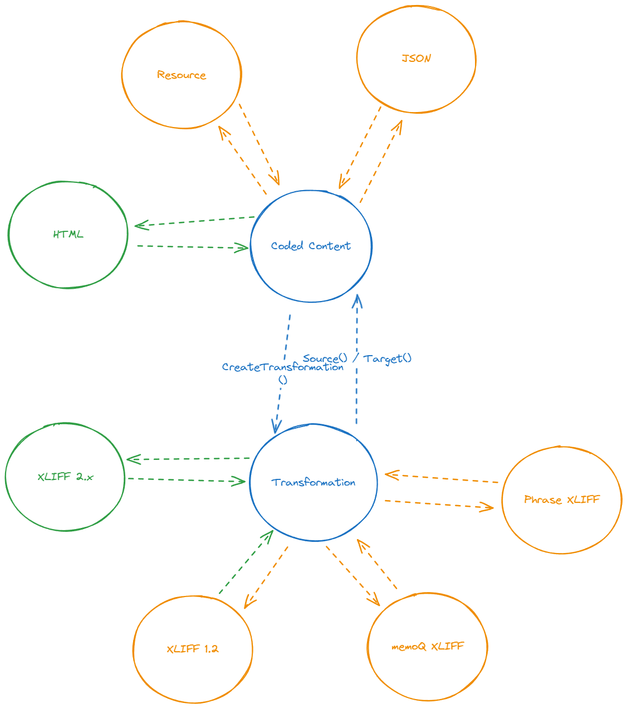

# Blackbird.Filters

Blackbird.Filters is a .NET library for processing and transforming content between different formats, with a focus on HTML content and XLIFF (XML Localization Interchange File Format) files. It provides tools for content extraction, transformation, and serialization.

## Main Library Structure



## Main Classes

The library is organized around two main components:

### CodedContent

`CodedContent` is the core class for representing content extracted from a file:

- **Original**: The original file content as plain text
- **TextUnits**: A list of extracted text units
- **CreateTransformation**: Creates a transformation object from the coded content
- **Serialize**: Serializes the content using the content coder that matches its content type

### Transformation

`Transformation` represents a transformation of content from one language to another:

- **GetUnits**: Gets all units recursively
- **GetSegments**: Gets all segments recursively
- **Source**: Gets the source as coded content
- **Target**: Gets the target as coded content
- **Parse**: Static method to parse content from a string or stream. The string or stream can contain XLIFF or HTML content, both will be deserialized using the appropriate serializer. If no appropriate deserializer is found it will throw an exception
- **Serialize**: Serializes the transformation in the default way: using XLIFF 2.2

## Code examples

### Simple translation
```cs
    public string TranslateFile(string fileContent)
    {
        // File content can be either HTML or XLIFF (more formats to follow soon)
        var transformation = Transformation.Parse(fileContent);

        foreach(var segment in transformation.GetSegments()) // You can also add .batch() to batch segments
        {
            // Implement API calls here
            segment.SetTarget(segment.GetSource() + " - Translated!"); 

            // More state manipulations can be performed here
            segment.State = SegmentState.Translated; 
        }

        // To continue and pass it as a transformation
        return transformation.Serialize();

        // To get the target as the original content format:
        return transformation.Target().Serialize();
    }
```

### Batch translation (when an API can take multiple segments at once and returns them in order)

##### Synchronous (example from ModernMT)
```cs
    [Action("Translate", Description = "Translate file content retrieved from a CMS or file storage. The output can be used in compatible actions")]
    public async Task<FileTranslationResponse> TranslateFile([ActionParameter] TranslateFileRequest input)
    {
        // [...Some verification code here]

        var client = new ModernMtClient(Credentials);
        var stream = await fileManagementClient.DownloadAsync(input.File);
        var content = await Transformation.Parse(stream);
        var segmentTranslations = content
            .GetSegments() // Iterate through all segments inside the content
            .Where(x => !x.IsIgnorbale && x.IsInitial) // Filter for segments that actually need to be translated
            .Batch(100) // Set an appropriate batch size depending on what the API can handle
            .Process(batch => client.Translate( // Apply the API translation method, takes a single batch
                input.SourceLanguage, 
                input.TargetLanguage, 
                batch.Select(x => x.GetSource()).ToList(),
                input.Hints?.Select(long.Parse).ToArray(), 
                input.Context, 
                input.CreateOptions())
            );


        var billedCharacters = 0;
        // Loop over each segment result. .Process() returns a tuple containing the original segment paired with each translation
        foreach(var (segment, translation) in segmentTranslations) 
        {
            segment.SetTarget(translation.TranslationText); // Update the target
            segment.State = SegmentState.Translated; // Update other variabels
            billedCharacters += translation.BilledCharacters; // Update other counters relevant to the output depending on the app
        }
    }
```

##### Async example (DeepL)
```cs
    private async Task<FileResponse> HandleInteroperableTransformation(Transformation content, ContentTranslationRequest input)
    {
          // [...Some option setup code here]

         // You'll probably want to separate the translation method for readability and proper typing.
         async Task<IEnumerable<TextResult>> BatchTranslate(IEnumerable<Segment> batch)
         {
            return await ErrorHandler.ExecuteWithErrorHandlingAsync(async () =>
                     await Client.TranslateTextAsync(batch.Select(x => x.GetSource()), content.SourceLanguage, input.TargetLanguage, options));
         }

         // The rest should be the same
         var segmentTranslations = await content
            .GetSegments()
            .Where(x => !x.IsIgnorbale && x.IsInitial)
            .Batch(100).Process(BatchTranslate);

         var sourceLanguages = new List<string>();
         foreach (var (segment, translation) in segmentTranslations)
         {
            segment.SetTarget(translation.Text);
            segment.State = SegmentState.Translated;
            if (!string.IsNullOrEmpty(translation.DetectedSourceLanguageCode))
            {
                  sourceLanguages.Add(translation.DetectedSourceLanguageCode.ToLower());
            }
         }
    }
```

## Serializers & Content coders:


### HtmlContentCoder

The `HtmlContentCoder` is responsible for processing HTML content:

- **Deserialize**: Converts HTML content into a structured `CodedContent` object
- **Serialize**: Converts a `CodedContent` object back to HTML
- **IsHtml**: Checks if a string is valid HTML content

The HTML coder handles:
- Inline elements vs. block elements
- Translatable attributes (alt, title, content, placeholder)
- Ignored elements (script, style)
- Whitespace normalization

### XliffSerializer

The `Xliff2Serializer` handles XLIFF 2.x format:

- **Deserialize**: Converts XLIFF content into a `Transformation` object
- **Serialize**: Converts a `Transformation` object back to XLIFF
- **IsXliff2**: Checks if a string is valid XLIFF 2.x content

The XLIFF serializer is compatible with the entire XLIFF 2.x standard. It supports additional custom XML tags. Not all submodules of XLIFF 2.x are *semantically supported* but their nodes will be persisted.

## Testing
Every serializer and content coder has an extensive set of test cases. F.e. the XLIFF 2.x test cases came directly from the XLIFF TC repository.

Finally, you can use the test Heap to test production files. The folder Heap/Files is ignored, and test cases are automatically generated for each file in here (remember to set copy to output directoy for each file). You can use this folder to drop in production files that can contain sensitive information.

## Publishing to NuGet Manually

To publish the Blackbird.Filters library to NuGet manually:

1. **Build the package**:
   ```
   dotnet pack -c Release
   ```

2. **Generate the NuGet package**:
   This will create a `.nupkg` file in the `bin/Release` directory.

3. **Push to NuGet**:
   ```
   dotnet nuget push bin/Release/Blackbird.Filters.<version>.nupkg -k <your-api-key> -s https://api.nuget.org/v3/index.json
   ```

4. **Alternative: Use the NuGet CLI**:
   ```
   nuget push bin/Release/Blackbird.Filters.<version>.nupkg -ApiKey <your-api-key> -Source https://api.nuget.org/v3/index.json
   ```
  
5. **Alternative: Go to NuGet.org** and upload manually.

### Package Configuration

The package configuration is defined in the `.csproj` file:

- **PackageId**: The unique identifier for the package
- **Version**: The version of the package
- **Authors**: The authors of the package
- **Description**: A description of the package
- **PackageTags**: Tags to help users find the package
- **PackageLicenseExpression**: The license for the package
- **PackageProjectUrl**: The URL for the project
- **PackageIcon**: The icon for the package

Make sure these properties are properly set in the `.csproj` file before publishing.